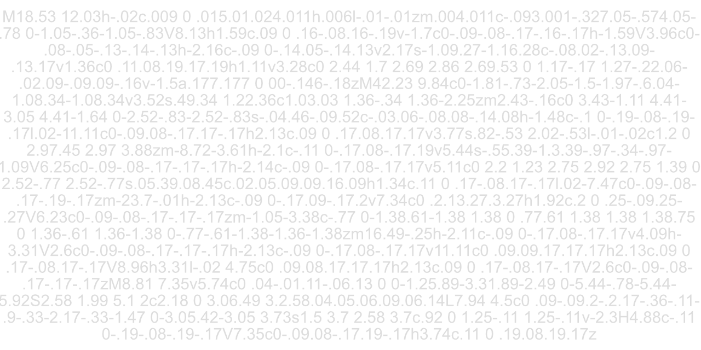

# Snippet collection

- [About](#about)

 

---

  

## About

Collection of 'GitHub Gist' snippets, stored in one place for convenience download.

This repository is intended to aid in delivering better code quality than from a single source of configuration and linting.
